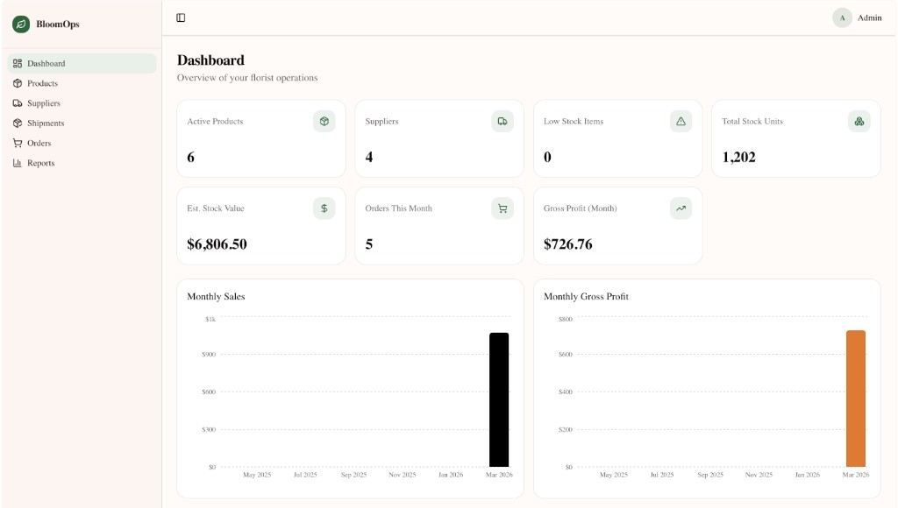
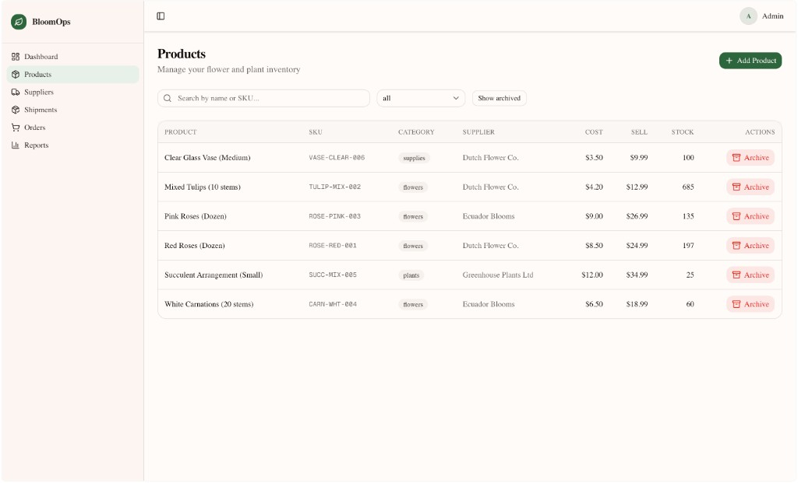
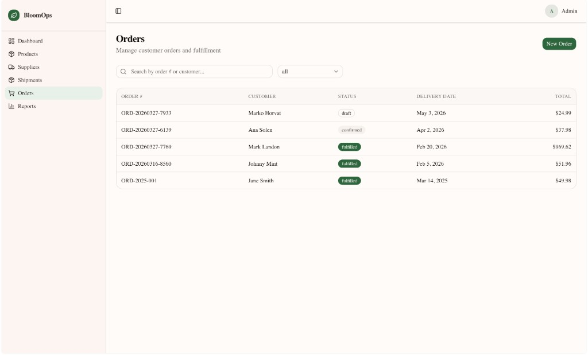
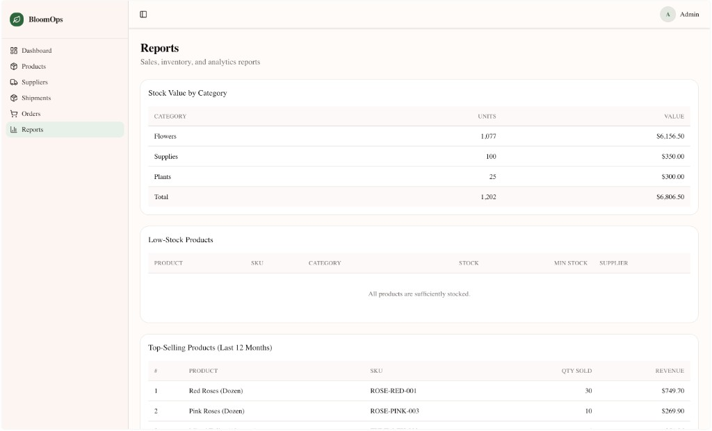
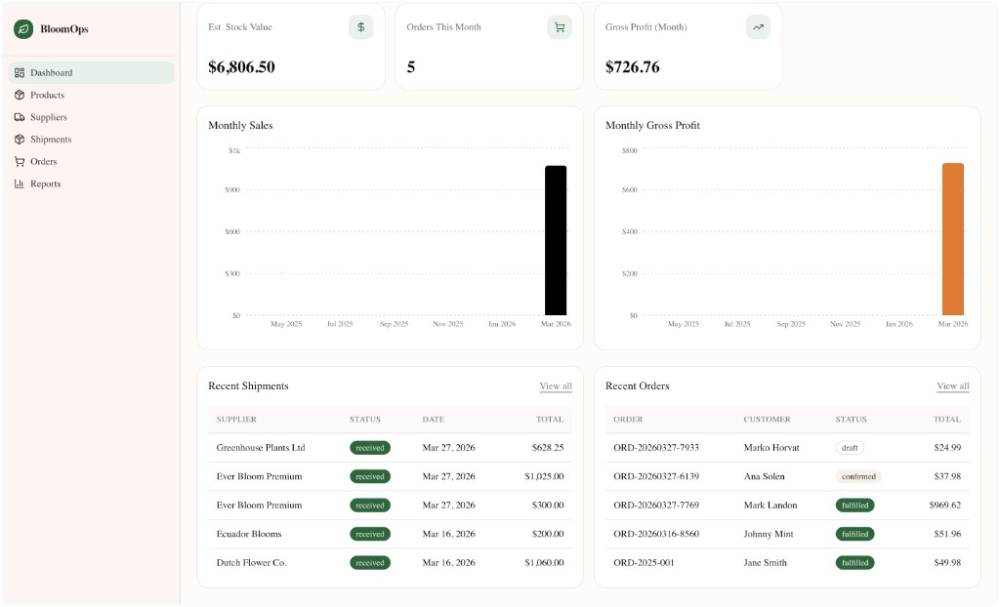
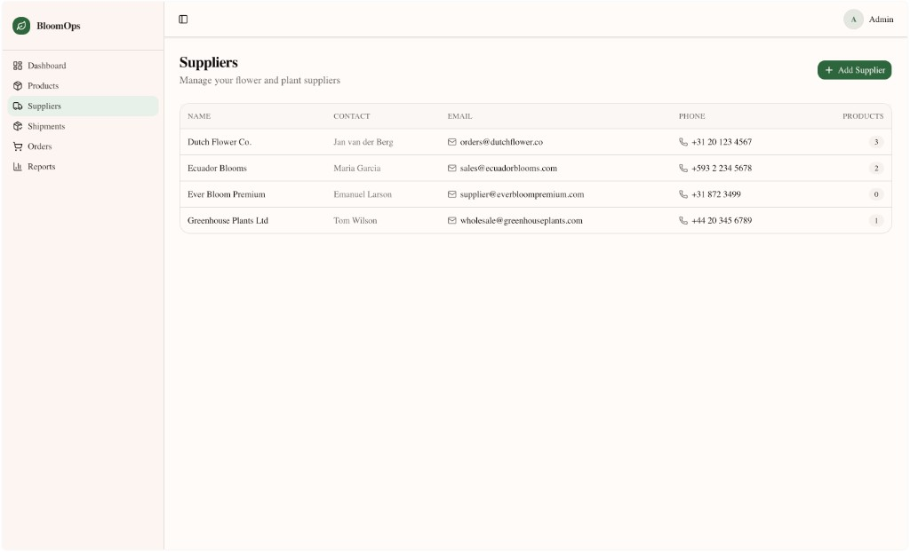
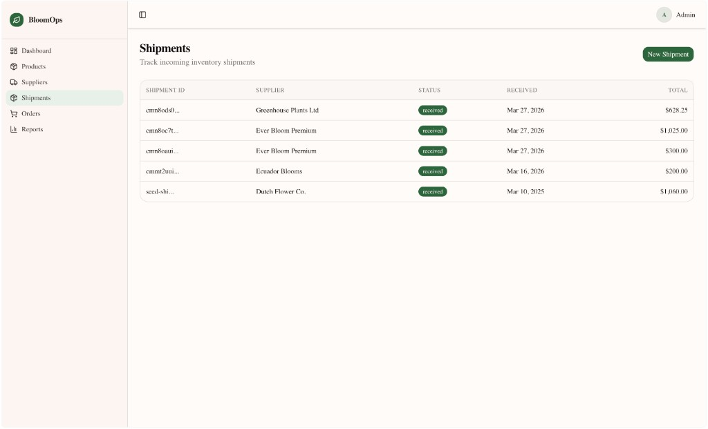
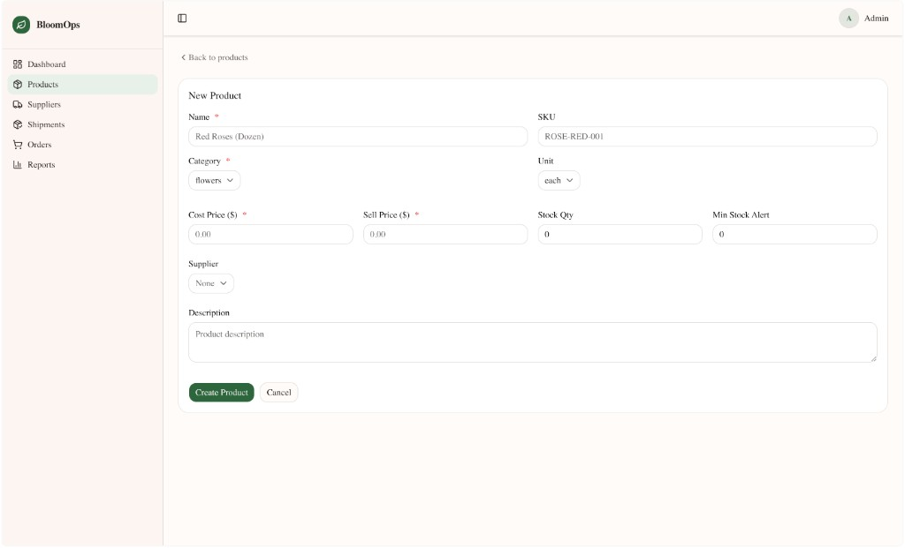
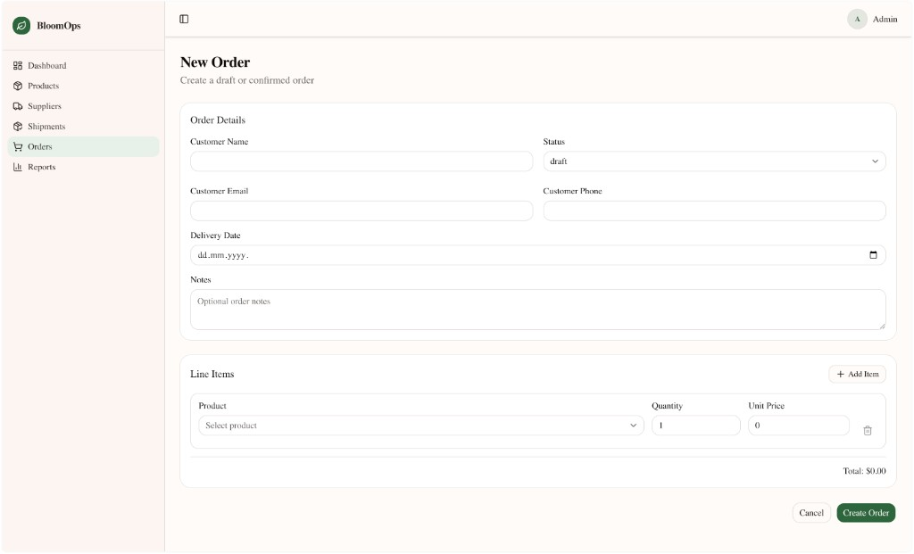
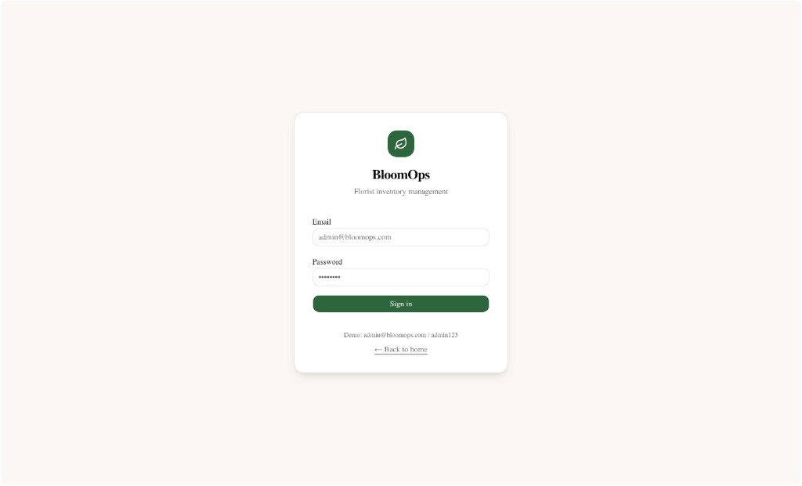

# BloomOps

Inventory and operations management for small florist businesses.

Track products and stock levels, manage suppliers and incoming shipments, create and fulfil customer orders, and monitor sales and profit performance — all from a single dashboard backed by a live PostgreSQL database.

**Live demo:** [bloomops-production.up.railway.app](https://bloomops-production.up.railway.app) · `admin@bloomops.com` / `admin123`

---

## Screenshots









<details>
<summary>More screenshots</summary>













</details>

---

## Features

- **Dashboard** — KPI cards, rolling 12-month sales and gross profit charts, recent shipments and orders
- **Products** — Create, edit, archive; SKU, category, cost/sell price, stock quantity, min-stock alerts; search and filter
- **Suppliers** — Contact records with linked product lists
- **Shipments** — Log incoming inventory with line items; track status from pending to received
- **Orders** — Customer orders with line items, delivery date, and status lifecycle (draft → confirmed → fulfilled → cancelled); cost snapshot at order time for accurate profit reporting
- **Reports** — Stock value by category, low-stock alerts, top-selling products, monthly sales and gross profit

---

## Tech Stack

| Layer | Technology |
|-------|------------|
| Framework | Next.js 16 (App Router) |
| Language | TypeScript |
| Styling | Tailwind CSS v4 |
| Components | shadcn/ui |
| ORM | Prisma 5 |
| Database | PostgreSQL |
| Auth | Auth.js v5 (credentials provider, JWT sessions) |
| Charts | Recharts |
| Validation | Zod v4 |

---

## Getting Started

**Prerequisites:** Node.js 18+ and PostgreSQL

```bash
git clone https://github.com/joso-skarica/bloomops.git
cd bloomops
npm install
cp .env.example .env
```

Edit `.env` with your database connection string and generate an auth secret:

```env
DATABASE_URL="postgresql://<user>@localhost:5432/bloomops?schema=public"
DIRECT_URL="postgresql://<user>@localhost:5432/bloomops?schema=public"
AUTH_SECRET="your-secret-here"   # generate with: npx auth secret
```

Set up the database and start the dev server:

```bash
createdb bloomops
npm run db:push
npm run db:seed        # optional — loads sample florist data
npm run dev
```

Open [http://localhost:3002](http://localhost:3002) and log in with `admin@bloomops.com` / `admin123`.

---

## Scripts

| Command | Description |
|---------|-------------|
| `npm run dev` | Dev server on port 3002 |
| `npm run build` | Production build |
| `npm run db:push` | Sync Prisma schema to database |
| `npm run db:migrate` | Create a migration (dev) |
| `npm run db:migrate:deploy` | Apply migrations (production) |
| `npm run db:seed` | Seed sample florist data |
| `npm run db:studio` | Open Prisma Studio |

---

## Deployment

BloomOps is deployed on [Railway](https://railway.app) with a PostgreSQL database. The `postinstall` script runs `prisma generate` automatically during the build.

Required environment variables:

| Variable | Description |
|----------|-------------|
| `DATABASE_URL` | PostgreSQL connection string |
| `DIRECT_URL` | Same as `DATABASE_URL` for Railway (separate pooled URL for Neon) |
| `AUTH_SECRET` | Random secret — generate with `npx auth secret` |
| `AUTH_URL` | Full deployment URL, e.g. `https://bloomops-production.up.railway.app` |

See [DEPLOYMENT.md](DEPLOYMENT.md) for the full step-by-step guide.

---

## Project Structure

```
app/
├── (dashboard)/          # Protected routes (require login)
│   ├── dashboard/        # KPI cards and charts
│   ├── products/         # List, create, edit, detail
│   ├── suppliers/        # List, create, edit, detail
│   ├── shipments/        # List, create, detail
│   ├── orders/           # List, create, edit, detail
│   └── reports/          # Stock, sales, and profit reports
├── api/                  # Route handlers (auth, orders, shipments)
└── login/                # Public login page
components/
├── products/             # Product form, search, archive button
├── suppliers/            # Supplier form, archive button
├── orders/               # Order form, status actions
├── shipments/            # Shipment form
├── dashboard/            # Monthly chart
└── ui/                   # shadcn/ui primitives
lib/
├── actions/              # Server actions — data fetching and mutations
├── validations/          # Zod schemas
├── format.ts             # Currency, date, number formatters
└── prisma.ts             # PrismaClient singleton
prisma/
├── schema.prisma         # PostgreSQL schema
└── seed.ts               # Sample data seed
```

---

## Notes

- Authentication uses hardcoded demo credentials — suitable for portfolio demonstration, not for public multi-user production use without replacing the auth layer.
- See [CASE_STUDY.md](CASE_STUDY.md) for a detailed write-up of implementation decisions and architecture.

## Copyright

Copyright © 2026 Joso Skarica. All rights reserved.

This repository is publicly visible for portfolio and evaluation purposes only.
No license is granted to use, copy, modify, distribute, or commercially exploit the source code in this repository.
